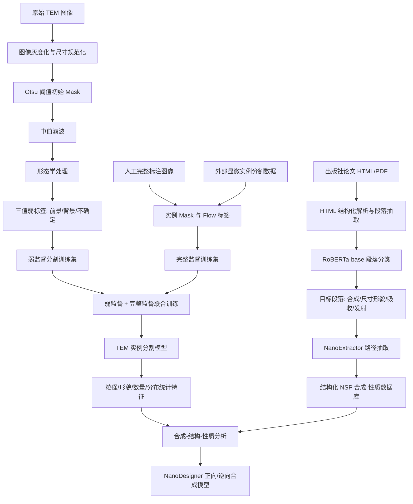
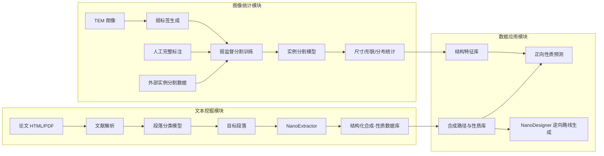

# 数据挖掘课程项目 - 最终报告

## 0. 项目基本信息

* **项目名称**：基于弱监督挖掘的纳米晶合成与图像统计分析系统
* **项目方向（对照 Proposal）**：复杂 Data-Centric 改进 / 弱监督学习 / 多模态科学数据挖掘 / LLM 辅助结构化信息抽取
* **代码仓库链接**：https://github.com/MOLMiner-BIT/MOLMiner
* **小组成员与分工**：

| 姓名  | 学号         | 开题角色       | 最终实际贡献（精确到模块/功能）                              |
| :-- | :--------- | :--------- | :-------------------------------------------- |
| 梁瑛平 | 3120225460 | 分割模型与弱监督方法 | 负责 TEM 图像实例分割模型设计，弱标签与完整标签联合训练策略，分割实验与可视化结果整理 | 
| 敬笑松 | 3220251300 | 数据收集与预处理   | 负责文献与 TEM 图像数据收集、原始数据清洗、图像数据审计、弱标签生成流程实现      |  
| 张昀芸 | 3120250955 | 统计分析与预测建模  | 负责分割结果统计特征提取、实验结果统计分析、合成条件与性质字段整理             |  
| 桂宁  | 3120250966 | 统计分析与预测建模  | 负责文本结构化数据整理、路径记录清洗、正向/逆向合成建模实验与报告结果汇总         | 
| 俞舜杰 | 3120250954 | 分割模型与弱监督方法 | 负责外部数据接入、模型训练脚本、消融实验、失败案例分析与软件界面测试            |  


---

## 1. 摘要（Abstract）

本项目面向胶体纳米晶合成中“实验试错成本高、TEM 图像统计依赖人工、文献合成路径难以结构化利用”的问题，构建了一个结合弱监督图像分割、文献文本挖掘与合成路径生成的数据挖掘系统。核心挑战包括 TEM 图像中纳米晶颗粒数量多、边界模糊、人工标注成本高，以及文献中合成条件、产物性质和路径信息分散在非结构化段落中。我们在仅 523 张人工标注图像的基础上，自动生成 7,344 张弱标签图像，并引入 4,357 张外部颗粒状目标数据，使手工标注图像占比约 4.3%。在 TEM 分割任务上，完整系统达到 AP50=82.5%、AP75=72.8%、AP90=25.3%、mIoU=84.5%，相比仅使用原始完整标注数据的基线 mIoU 提升 15.2 个百分点。文本挖掘方面，系统从约 170,000 篇文献中筛选目标段落，最终自动抽取超过 160,000 条结构化合成-性质记录；微调后的 NanoExtractor 在人工核查加权评分中达到 92%。主要局限在于弱标签对图像噪声与形态学参数敏感，合成路径生成仍以人工核查为主；公开仓库已整理分割与文本抽取核心代码，但全量训练数据与文献爬取/段落分类流水线尚未完全开源。

---

## 2. 问题定义与动机

### 2.1 研究背景与核心挑战

胶体纳米晶的粒径、形貌和光谱性质直接影响其在显示、催化、生物成像和光电器件中的应用性能。传统研究流程通常需要先人工设计合成条件，再通过 TEM、光谱等表征手段观察产物，最后根据结果反复调整实验条件，导致实验周期长、试错成本高。特别是在 TEM 图像分析环节，一张高密度纳米晶图像常包含超过 200 个目标，单个目标标注约需 5-6 秒，粗略估计每张图像需 17-20 分钟人工标注，难以支撑大规模数据挖掘。

* **核心问题**：如何在人工标注极少、数据噪声较强、图像与文本异构的真实材料数据场景中，自动提取纳米晶结构特征与合成路径信息，并支撑后续合成预测与条件推荐。
* **现有方案的不足**：传统阈值分割和分水岭方法对噪声、背景不均和颗粒粘连敏感；纯人工文献整理成本高、覆盖面有限；直接训练性质预测模型又受到高质量结构化配方数据不足的限制。
* **本项目目标**：构建“图像统计特征提取 + 文献合成路径挖掘 + 正向/逆向合成建模”的端到端系统，在显著降低人工标注和文献整理成本的同时，提高纳米晶结构数据与合成条件数据的可用性。

### 2.2 任务形式化

本项目包含三个关联任务。

**任务一：TEM 图像分割与结构统计提取**

* **输入**：TEM 图像集合
  $$
  \mathcal{I} = {I_1, I_2, ..., I_n}
  $$
  其中少量图像具有完整实例标注
  $$
  \mathcal{Y}^{full} = {Y_i^{inst}}
  $$
  大量图像仅有弱监督生成的前景/背景/不确定区域标签
  $$
  \mathcal{Y}^{weak} = {Y_i^{weak}}
  $$
* **输出**：每张图像中纳米晶颗粒的实例掩膜
  $$
  \hat{M}*i = {m*{i1}, m_{i2}, ..., m_{ik}}
  $$
  以及粒径、形貌、数量、面积分布等统计特征
  $$
  s_i = (\text{mean size}, \text{std size}, \text{aspect ratio}, \text{shape type}, ...)
  $$
* **成功标准**：在测试集上达到 mIoU ≥ 80%，AP50 ≥ 80%，并显著减少人工标注依赖。

**任务二：文献文本挖掘与合成路径结构化**

* **输入**：纳米晶合成相关文献集合
  $$
  \mathcal{D} = {d_1, d_2, ..., d_m}
  $$
  包括 HTML、PDF 或解析后的段落文本。
* **输出**：结构化合成记录
  $$
  r = (\text{product}, \text{precursors}, \text{ligands}, \text{solvent}, \text{temperature}, \text{time}, \text{route}, \text{properties})
  $$
* **成功标准**：目标段落筛选具有较高召回率，路径抽取结果经人工核查评分显著优于通用化学大模型基线。

**任务三：正向/逆向合成建模**

* **正向任务输入**：合成条件向量
  $$
  x = (\text{temperature}, \text{time}, \text{precursor}, \text{ligand}, \text{solvent}, \text{concentration}, ...)
  $$
* **正向任务输出**：材料结构或性质
  $$
  y = (\text{size}, \text{shape}, \text{emission peak}, ...)
  $$
* **逆向任务输入**：目标产物、约束反应物和目标性质。
* **逆向任务输出**：候选合成步骤、路线与实验条件。
* **成功标准**：能够生成化学上合理、字段完整、可人工核验的候选合成路线，并为后续实验优化提供参考。

### 2.3 与开题报告的偏差说明

开题报告主要聚焦“从 TEM 图像中提取统计特征，并结合合成条件进行粒径回归与形貌分类预测”。最终实现过程中，我们保留了 TEM 图像弱监督分割这一核心任务，同时将合成条件数据部分扩展为“文献结构化挖掘 + 合成路径抽取 + 正向/逆向合成生成”。这一调整的原因是公开结构化配方数据规模有限，直接监督预测模型容易受到样本量和字段缺失影响；因此项目先构建更大规模的纳米晶合成-性质数据库，为后续可靠预测建模提供数据基础。最终系统更强调 Data-Centric 数据构建与弱监督挖掘，而不是单一的性质回归模型。

---

## 3. 数据来源与全量审计报告

### 3.1 数据集说明

| 数据集            | 来源 / 获取方式                                         | 规模                                    | 用途                  |
| :------------- | :------------------------------------------------ | :------------------------------------ | :------------------ |
| 人工标注 TEM 图像数据  | 自建标注数据，来自开源论文和互联网 TEM 图像                          | 523 张图像，49,976 个实例                    | 完整监督训练、测试集构建、分割性能评估 |
| 自动弱标签 TEM 图像数据 | 基于 Otsu 阈值、中值滤波和形态学规则自动生成                         | 7,344 张图像，约 918,551 个弱标签实例/区域         | 弱监督训练，学习前景/背景区分     |
| 外部颗粒状目标数据      | 公开细胞、病毒、纳米晶和显微图像实例分割数据集                           | 4,357 张图像，约 239,471 个实例               | 预训练与鲁棒性增强           |
| 文献全文/段落数据      | Elsevier、Springer Nature、Wiley 等出版社文献 HTML/PDF 解析 | 约 170,000 篇文章                         | 文献段落筛选、合成路线挖掘       |
| 目标段落数据         | RoBERTa-base 多标签段落分类器筛选                           | 约 130,000 个目标段落                       | NanoExtractor 输入    |
| 合成路径人工标注数据     | 167 篇论文中人工标注                                      | 300 条合成路径                             | 路径挖掘模型微调与评估         |
| NSP 合成-性质数据库   | NanoExtractor 自动抽取并过滤                             | 超过 160,000 条结构化合成-性质记录，来自约 47,000 篇文章 | 正向/逆向合成建模、数据分析与检索   |

### 3.2 数据质量全量审计

| #  | 数据问题               | 量化规模                                             | 发现方式（精确到脚本/函数）                                                       | 解决方案                                               | 处理前 → 处理后效果                                   |
| :- | :----------------- | :----------------------------------------------- | :------------------------------------------------------------------- | :------------------------------------------------- | :-------------------------------------------- |
| 1  | 人工标注样本稀缺           | 人工标注仅 523 张图像，占总训练图像约 4.3%；人工实例 49,976 个，占约 4.1% | `segmentation/train/data.py`（EMPSDataset 统计）/ `segmentation/README.md` | 引入自动弱标签生成与外部颗粒状目标数据                                | 训练图像规模从 523 张扩展到约 12,224 张，增加约 23.4 倍         |
| 2  | 颗粒密集与粘连导致实例边界不清    | 单张 TEM 图像常超过 200 个目标，人工标注约 17-20 分钟/张            | `segmentation/train/eval.py`（AP/mIoU 评测）                           | 弱标签学习前景/背景，完整标签学习实例区分，并使用 Cellpose 实例分割框架   | mIoU 从 69.3% 提升到 84.5%，AP75 从 51.6% 提升到 72.8% |
| 3  | 自动弱标签对图像噪声和形态学参数敏感 | 失败案例中高噪声背景被错误分割为前景连通区域                           | `segmentation/preprocess/predict.py`（`seg_target` / `process`）     | 增加中值滤波、形态学后处理和不确定区域标记；后续计划加入去噪模型                   | 弱标签可用于大规模训练，但在高噪声图像中仍有误检，需人工抽检                |
| 4  | 文献段落中目标信息稀疏        | 约 170,000 篇文章中，最终保留约 47,000 篇，保留比例约 27.6%        | 段落分类流水线（**未入库**，实验在内部完成）                                      | 使用 RoBERTa-base 多标签段落分类器筛选合成方法、尺寸形貌、吸收光谱、发射光谱等目标段落 | 段落分类召回率达到 0.96，减少无关段落进入抽取模型                   |
| 5  | 合成路径字段不完整或含否定描述    | 原始抽取结果中存在 “NOT MENTION” 和低置信字段                   | `llmdesinger/test_model_optimized.py` / 后处理过滤规则（内部脚本）            | 过滤 NOT MENTION 与 low-confidence 样本，仅保留高质量可对齐记录     | 最终得到超过 160,000 条结构化合成-性质记录，平均每篇有效文章约 3.4 条    |

**开题预测 vs 实际差异**：开题阶段预期的主要挑战是标注稀缺、颗粒密集和图像来源分布差异。实际实验中，标注稀缺问题比预期更突出：人工完整标注仅占图像数量约 4.3%，难以支撑纯监督训练；因此项目加大了弱标签与外部数据的使用比例。文本侧原计划使用约 3,500 条配方记录进行预测建模，但实际发现高质量结构化配方数据不足，最终将重点转向大规模文献挖掘，构建超过 160,000 条结构化记录，为后续预测模型提供更稳健的数据基础。

### 3.3 数据处理管道



---

## 4. 方法设计

### 4.1 系统架构



### 4.2 核心创新点说明

* **创新点 1：面向 TEM 图像的弱监督标签挖掘与联合训练**
  TEM 成像中背景通常更亮，而纳米晶颗粒会阻挡电子束并呈现较暗区域。基于这一领域先验，系统设计了 Otsu 阈值、中值滤波、形态学处理和三值弱标签生成流程，将大量无标注图像转化为可训练的弱监督数据。弱标签主要学习前景/背景区分，完整标签学习实例边界与颗粒分离，从而缓解人工标注样本不足的问题。

* **创新点 2：多来源数据融合增强分割鲁棒性**
  仅依靠 523 张人工标注 TEM 图像很难覆盖真实场景中的噪声、背景、形貌和尺度变化。系统引入细胞、病毒、纳米晶等公开颗粒状目标实例分割数据，使模型先学习通用“颗粒状目标”的轮廓和实例分离能力，再迁移到 TEM 纳米晶场景。实验表明，多来源标签组合对高阈值精确分割尤其有帮助，完整系统 AP90 达到 25.3%，相比基线提升 13.2 个百分点。

* **创新点 3：从文献到结构化合成-性质数据库的数据挖掘闭环**
  系统不是直接依赖已有小规模配方表，而是从 170,000 篇文献中自动解析段落、筛选目标段落、抽取合成路径和性质字段，并通过过滤低置信和 NOT MENTION 样本构建大规模 NSP 数据库。该设计将非结构化文献转化为可建模数据，为后续正向预测和逆向设计提供数据基础。

### 4.3 技术栈

| 模块     | 工具 / 框架                                 | 仓库对应路径 |
| :----- | :-------------------------------------- | :--- |
| 图像处理   | OpenCV, scikit-image, NumPy             | `segmentation/preprocess/` |
| 深度学习   | PyTorch, Cellpose 实例分割框架         | `segmentation/train/`、`segmentation/cellpose/` |
| 数据处理   | Pandas, NumPy, tqdm                     | `segmentation/train/data.py` |
| 文本分类   | RoBERTa-base, Transformers              | 未入库（内部实验） |
| LLM 抽取 | Qwen3-14B 微调为 NanoExtractor（LLaMA-Factory + LoRA） | `llmdesinger/` |
| 合成路线生成 | Qwen3-14B 微调为 NanoDesigner             | `llmdesinger/inverse_design/` |
| 实验评估   | `eval.py`、Cellpose metrics、人工打分      | `segmentation/train/eval.py`、`llmdesinger/results/` |
| 可视化与软件 | Matplotlib, Qt/Cellpose GUI              | `segmentation/main.py`、`docs/software.md` |

---

## 5. 实验设计与结果

### 5.1 评测数据集与指标

* **测试集构建**：
  TEM 分割任务使用人工完整标注图像作为可靠评测集。训练数据包括人工完整标注数据、自动弱标签数据和外部实例分割数据；测试时仅用人工标注图像计算实例分割指标。文本路径抽取任务使用 167 篇论文中的 300 条人工标注合成路径作为评测基准，并通过人工核查加权评分评价抽取质量。

* **数据切分方式**：
  图像任务建议按数据来源和图像文件分组切分，避免同一论文或同一图像增强版本同时出现在训练集和测试集。文本任务建议按论文级别切分，避免同一论文段落同时进入训练和测试。

* **核心评测指标**：

| 指标                     | 含义                         | 评估工具（仓库实际路径）                              |
| :--------------------- | :------------------------- | :--------------------------------------- |
| AP50                   | IoU 阈值为 0.50 时的实例分割平均精度    | `segmentation/train/eval.py` / Cellpose metrics |
| AP75                   | IoU 阈值为 0.75 时的实例分割平均精度    | `segmentation/train/eval.py`                    |
| AP90                   | IoU 阈值为 0.90 时的高精度实例分割平均精度 | `segmentation/train/eval.py`                    |
| mIoU                   | 实例分割平均交并比                  | `segmentation/train/eval.py`                    |
| Paragraph Recall       | 文献目标段落筛选召回率                | 段落分类流水线（未入库）                               |
| Weighted Average Score | 路径抽取字段经人工核查后的加权平均得分        | `llmdesinger/test_model_optimized.py`；预存结果 `llmdesinger/results/optimized_results_checkpoint-1476.json` |
| 记录保留率                  | 最终有效文章数 / 原始文章数            | NSP 数据库统计（HuggingFace 数据集）                  |

### 5.2 基线对比实验

#### TEM 图像分割结果

| 方法                | 训练数据设置              |   AP50   |   AP75   |   AP90   |   mIoU   |
| :---------------- | :------------------ | :------: | :------: | :------: | :------: |
| 0D Baseline       | 仅使用本数据集完整人工标注       |   68.5   |   51.6   |   12.1   |   69.3   |
| 0D+W              | 人工标注 + 自动弱标签        |   80.1   |   70.1   |   22.9   |   81.9   |
| 0D+LD             | 人工标注 + 外部完整标签数据     |   81.3   |   66.3   |   18.1   |   81.9   |
| **0D+LD+W（Ours）** | 人工标注 + 外部数据 + 自动弱标签 | **82.5** | **72.8** | **25.3** | **84.5** |

完整系统相比仅使用人工完整标注的基线，AP50 提升 14.0 个百分点，AP75 提升 21.2 个百分点，AP90 提升 13.2 个百分点，mIoU 提升 15.2 个百分点。结果说明，弱标签和外部数据不仅提高了普通阈值下的分割精度，也对 AP90 这种高阈值精确分割有明显帮助。

#### 文本路径挖掘结果

| 方法                      | 模型/设置                  |  加权平均得分 |
| :---------------------- | :--------------------- | :-----: |
| ChemLLM                 | 通用化学大模型                |    1%   |
| ChemDFM                 | 通用化学大模型                |    3%   |
| SciLitLLM               | 科学文献大模型                |    9%   |
| Grok-4                  | 通用大模型对照                |   56%   |
| GPT-5.2                 | 通用大模型对照                |   57%   |
| **NanoExtractor（Ours）** | Qwen3-14B 微调（LLaMA-Factory + LoRA） | **92%** |

NanoExtractor 的优势来自任务专用微调和面向纳米晶文献的字段定义，能够同时抽取合成步骤、合成路线、产物名称、尺寸形貌和光谱性质等结构化信息。

### 5.3 消融实验

| 消融设置            |   AP50   |   AP75   |   AP90   |   mIoU   | 说明                      |
| :-------------- | :------: | :------: | :------: | :------: | :---------------------- |
| 完整系统：0D+LD+W    | **82.5** | **72.8** | **25.3** | **84.5** | 使用人工完整标注、外部数据和自动弱标签     |
| w/o 弱标签：0D+LD   |   81.3   |   66.3   |   18.1   |   81.9   | 去除自动弱标签后，AP75/AP90 明显下降 |
| w/o 外部数据：0D+W   |   80.1   |   70.1   |   22.9   |   81.9   | 去除外部数据后，泛化能力下降          |
| w/o 弱标签与外部数据：0D |   68.5   |   51.6   |   12.1   |   69.3   | 仅依赖少量人工标注，性能最低          |

实验表明，弱标签主要提升模型对大量真实 TEM 图像前景/背景的覆盖能力，外部数据主要提升实例轮廓和目标分离的鲁棒性。两者结合时，模型在高 IoU 阈值下表现最好。

### 5.4 一键复现命令

仓库按 `segmentation/`（TEM 弱监督分割）与 `llmdesinger/`（文献结构化抽取与逆向设计）两个子模块组织。根目录存在历史遗留的同名 `cellpose/`、`train/`、`preprocess/` 副本，**复现时请统一进入 `segmentation/`**。

#### 复现路径总览

| 路径 | 目标 | 命令 | 耗时 | 数据依赖 |
| :--- | :--- | :--- | :--- | :--- |
| A 演示 | GUI 分割单张示例图 | `cd segmentation && python main.py` | ~10 min | 仓库内置 1 张示例 |
| B 评测 | 复现 AP/mIoU 指标 | `cd segmentation/train && python eval.py --data-dir ../data --pretrained ../ckpt/epoch28.pth` | ~30 min | 需下载 80 张评测集 |
| B 训练 | 复现 0D+LD+W 训练 | `cd segmentation/train && bash run.sh` | 数小时 | 需全量约 12,224 张训练图 |
| C 文本 | 查看路径抽取结果 | 打开 `llmdesinger/results/optimized_results_checkpoint-1476.json` | 即时 | 无 |
| C 推理 | 运行 NanoExtractor | `cd llmdesinger && python test_model_optimized.py` | ~1 h | Qwen3-14B + LoRA 权重 |

#### 最小复现（推荐答辩演示）

```bash
git clone https://github.com/MOLMiner-BIT/MOLMiner.git
cd MOLMiner/segmentation

conda create -n sophon python=3.8 -y
conda activate sophon
pip install torch==1.11.0 torchvision==0.12.0
pip install -r requirements.txt

python main.py
# GUI 中加载 ckpt/epoch28.pth，打开 data/examples/images/1-0001_16.png 运行分割
```

#### 分割评测与训练

```bash
# 环境安装（详见 segmentation/train/README.md）
cd MOLMiner/segmentation/train
conda activate sophon

# 评测预训练权重
python eval.py --data-dir ../data --pretrained ../ckpt/epoch28.pth --device cuda

# 弱标签生成（需下载检测权重到 segmentation/preprocess/weights/）
cd ../preprocess
python predict.py --inputs ../data/weak_data/images --outputs ../data/weak_data/weak_labels

# 完整训练：弱标签 + 外部数据预训练 → 人工标注微调
cd ../train
python train_ours.py --data-dir ../data --device cuda --batch_size 8 --epochs 100 \
  --save_path runs/pretrain --weak_data --extra_data
python train_ours.py --data-dir ../data --device cuda --batch_size 8 --epochs 100 \
  --save_path runs/finetune --labeled_data --weak_data --extra_data \
  --ckpt_path runs/pretrain/best.pth
```

#### 文本路径抽取

```bash
cd MOLMiner/llmdesinger
conda create -n llamafac python=3.12 -y && conda activate llamafac
pip install -r requirements.txt

# 零 GPU：直接查看预存推理结果
# llmdesinger/results/optimized_results_checkpoint-1476.json

# 完整推理（需下载 Qwen3-14B 与 LoRA 权重，并修改脚本内路径）
python test_model_optimized.py
```

#### 数据目录规范

```text
segmentation/data/
├── train/images/ + train/segmaps/       # 523 张人工完整标注
├── test/images/  + test/segmaps/        # 80 张评测集
├── weak_data/images/ + weak_labels/     # 7,344 张弱标签（需申请或自行生成）
└── extra_data/<dataset>/images/ + segmaps/  # 4,357 张外部颗粒数据
```


## 6. 误差分析与失败复盘

### 6.1 失败案例分析

| #  | 失败类型      | 输入片段 / 场景             | 系统输出                                   | 正确结果               | 根因分析                                | 改进方向                              |
| :- | :-------- | :-------------------- | :------------------------------------- | :----------------- | :---------------------------------- | :-------------------------------- |
| 1  | 高噪声背景误检   | 背景噪声强、颗粒稀疏的 TEM 图像    | 背景噪声被形态学流程连接成大面积前景区域                   | 仅分割真实颗粒区域          | 弱标签生成高度依赖阈值和形态学参数，噪声分布变化时易失效        | 引入 BM3D/非局部均值/深度去噪模型；在弱标签中扩大不确定区域 |
| 2  | 密集颗粒粘连    | 多个纳米晶紧密堆叠，边界灰度差异小     | 多个颗粒被合并成一个实例                           | 每个颗粒应独立分割          | 实例分离依赖边界和 flow 学习，少量完整标注不足以覆盖复杂粘连模式 | 增加局部边界标注；加入距离变换或边界损失              |
| 3  | 文献字段缺失    | 段落只描述产物性质，未完整给出前驱体或温度 | NanoExtractor 输出部分字段为 NOT MENTION 或低置信 | 应保留已知字段，同时标记缺失字段   | 文献中合成条件分散在表格、正文和补充材料中，单段输入信息不足      | 引入跨段落上下文检索；融合表格解析和补充材料信息          |
| 4  | 路径生成可行性不足 | 给定目标产物、约束反应物和目标尺寸     | NanoDesigner 能生成完整步骤，但部分温度/时间需人工核验     | 化学条件应符合已知合成经验和文献证据 | 生成模型学习的是文献模式，不等价于真实实验验证             | 增加基于数据库相似案例的检索增强和规则校验             |

### 6.2 分组误差分析

| 问题类型      |    样本数 / 规模   |        关键指标       | 差异原因分析                       |
| :-------- | :-----------: | :---------------: | :--------------------------- |
| 仅人工完整标注训练 |    523 张图像    |     mIoU=69.3     | 样本量不足，难以覆盖不同背景、颗粒尺寸和形貌       |
| 加入弱标签训练   |  7,344 张弱标签图像 |     mIoU=81.9     | 大量无标注图像提供了真实 TEM 分布中的前景/背景信息 |
| 加入外部数据训练  |  4,357 张外部图像  |     mIoU=81.9     | 外部颗粒状目标提升了实例轮廓学习能力，但存在领域差异   |
| 完整多来源训练   |  约 12,224 张图像 |     mIoU=84.5     | 弱标签覆盖真实分布，外部数据增强实例分离能力，二者互补  |
| 文献目标段落筛选  | 约 170,000 篇文章 |    Recall=0.96    | 多标签段落分类有效保留合成、形貌、吸收和发射相关段落   |
| 路径抽取      | 300 条人工标注路径评测 | NanoExtractor=92% | 专用微调模型显著优于通用化学/科学大模型         |

### 6.3 高阶能力自评

* [x] **数据质量闭环**：系统针对人工标注稀缺、弱标签噪声、文献字段缺失等问题设计了弱监督、外部数据融合、低置信过滤和人工核查流程，并量化了 mIoU、AP 和路径抽取得分提升。
* [x] **LLM/Agent 协同数据科学**：系统使用 Qwen3-14B 微调构建 NanoExtractor（`llmdesinger/`），用于文献合成路径抽取；使用 Qwen3-14B 在 `llmdesinger/inverse_design/` 构建 NanoDesigner 逆向合成原型，并分析了生成失败和人工核查边界。

---

## 7. 代码仓库审计

* **最终 commit 统计**（本地仓库 `git log` 统计，2026-06）：

  * 总 Commit 数：15
  * 活跃贡献人数：5
  * 协作平台：https://github.com/MOLMiner-BIT/MOLMiner

* **仓库最终目录结构**：

```text
MOLMiner/
├── README.md
├── report-mid.md
├── final-report.md
│
├── segmentation/                      # 【主模块】TEM 弱监督分割（Sophon）
│   ├── README.md
│   ├── main.py                        # 启动 GUI
│   ├── requirements.txt
│   ├── ckpt/epoch28.pth               # 预训练分割权重
│   ├── data/examples/                 # 完整标注示例（1 张）
│   ├── data/weak_data_examples/       # 弱标签示例（1 张）
│   ├── train/
│   │   ├── train_ours.py              # 弱监督 + 完整标注联合训练
│   │   ├── eval.py                    # AP50/AP75/AP90/mIoU 评测
│   │   ├── data.py                    # EMPSDataset 数据加载
│   │   └── run.sh                     # 一键微调脚本
│   ├── preprocess/
│   │   ├── predict.py                 # 检测框 + Otsu 弱标签生成
│   │   └── weights/                   # 检测模型权重（需下载）
│   ├── cellpose/                      # 修改版 Cellpose 核心 + GUI
│   └── docs/software.md
│
└── llmdesinger/                       # 【主模块】文献抽取与逆向设计
    ├── train.py / train_config.yaml   # NanoExtractor 微调
    ├── test_model_optimized.py        # 路径抽取推理评测
    ├── test_labels.json               # 测试集样例
    ├── results/optimized_results_checkpoint-1476.json  # 预存论文结果
    ├── saves/                         # LoRA 权重（需下载）
    ├── Qwen3-14B/                     # 基座模型（需自行下载）
    └── inverse_design/                # NanoDesigner 逆向合成
```

* **报告路径与实际代码映射**：

| 报告/设计文档中的写法 | 实际代码位置 | 说明 |
| :--- | :--- | :--- |
| `src/weak_label.py` | `segmentation/preprocess/predict.py` | 弱标签生成 |
| `src/evaluate_seg.py` | `segmentation/train/eval.py` | 分割指标评测 |
| `src/evaluate_extractor.py` | `llmdesinger/test_model_optimized.py` | 路径抽取推理 |
| `src/text_mining/*` | **未入库** | 段落分类、文献爬取流水线未公开 |
| `notebooks/eda_image_distribution.ipynb` | **未入库** | 图像分布统计见 README |

* **仓库已知限制**：

  1. 根目录 `cellpose/`、`train/`、`preprocess/` 与 `segmentation/` 内同名目录重复，复现请统一使用 `segmentation/`。
  2. 全量训练/评测数据未随仓库分发；523 张人工标注与 7,344 张弱标签需按 `segmentation/README.md` 另行获取。
  3. `llmdesinger/test_model_optimized.py` 内含服务器硬编码路径，本地复现前需改为相对路径。
  4. 文献段落分类与爬取脚本未公开，文本侧公开部分以 LLM 微调与推理为主。


## 8. 结论与局限性

### 8.1 主要贡献总结

1. **构建了多来源 TEM 图像训练数据体系**：在 523 张人工完整标注图像基础上，自动生成 7,344 张弱标签图像，并引入 4,357 张外部实例分割图像，使训练图像总规模达到约 12,224 张，手工标注图像占比约 4.3%。

2. **弱监督与外部数据显著提升 TEM 分割性能**：完整系统达到 AP50=82.5%、AP75=72.8%、AP90=25.3%、mIoU=84.5%；相比仅使用人工完整标注的基线，mIoU 提升 15.2 个百分点，AP75 提升 21.2 个百分点。

3. **实现从大规模文献到结构化合成-性质记录的自动挖掘**：系统从约 170,000 篇文章中筛选目标段落，最终保留约 47,000 篇有效文章，自动抽取超过 160,000 条结构化合成-性质记录，平均每篇有效文章约 3.4 条记录。

4. **构建了面向纳米晶合成路径的专用抽取模型**：NanoExtractor 基于 Qwen3-14B 微调（LLaMA-Factory + LoRA），在 300 条人工标注路径评测中获得 92% 加权平均得分，显著优于多个通用化学/科学大模型对照。

5. **完成了从数据挖掘到应用建模的原型闭环**：项目不仅提取 TEM 结构统计特征，还构建了可用于正向性质分析和逆向合成路线生成的结构化数据库，并初步实现 NanoDesigner 路径生成原型。

### 8.2 局限性与未来工作

| 局限性                | 影响                      | 未来可行方向                           |
| :----------------- | :---------------------- | :------------------------------- |
| 弱标签对阈值、噪声和形态学参数敏感  | 在高噪声背景或低对比度图像中容易产生误检    | 引入图像去噪模型、自适应阈值和不确定性估计            |
| 人工完整标注仍然较少         | 高精度实例边界学习不足，AP90 仍偏低    | 增加主动学习标注，优先标注高不确定样本和失败场景         |
| 外部数据与 TEM 图像存在领域差异 | 可能引入与纳米晶真实纹理不一致的先验      | 使用领域自适应或对外部数据进行类别/形貌筛选           |
| 文献抽取依赖单段或局部上下文     | 合成条件分散在正文、表格和补充材料时容易缺字段 | 融合跨段落检索、表格解析和 PDF 补充材料抽取         |
| 路径生成尚未经过真实实验闭环验证   | 生成路线只能作为候选方案，不能直接替代实验   | 引入基于相似案例的检索增强、规则校验和专家反馈          |
| 公开代码仓库部分模块未开源       | 段落分类/文献爬取未入库，全量图像数据需另行申请 | 持续补全 `src/text_mining` 流水线；在 README 中明确数据获取方式 |

---

## 9. AI 工具辅助使用声明

| 使用场景   | AI 工具名称                             | 具体辅助环节（精确到文件/功能）                                                   | 团队审查与纠错说明                                   |
| :----- | :---------------------------------- | :----------------------------------------------------------------- | :------------------------------------------ |
| 文献路径抽取 | Qwen3-14B / NanoExtractor | 用于从目标段落中抽取合成步骤、产物名称、合成路线、尺寸形貌和光谱性质字段（`llmdesinger/`） | 使用 167 篇论文中 300 条人工标注路径进行评估，通过人工核查与加权评分确认质量 |
| 合成路线生成 | Qwen3-14B / NanoDesigner | 根据目标产物、约束反应物和目标性质生成候选合成步骤与条件（`llmdesinger/inverse_design/`） | 生成结果仅作为候选路线，由团队根据化学常识和文献相似案例进行人工核验 |
| 报告撰写   | ChatGPT | 辅助按照课程 final-report 模板整理摘要、方法、实验、误差分析和局限性表述 | 团队逐项核对数据、代码路径、commit 统计和实验指标 |
| 代码编写与审计 | Cursor | 辅助整理仓库结构、修正复现路径、补全 `final-report.md` 与 `report-mid.md` | 人工审核并与 `segmentation/`、`llmdesinger/` 源码交叉验证 |
