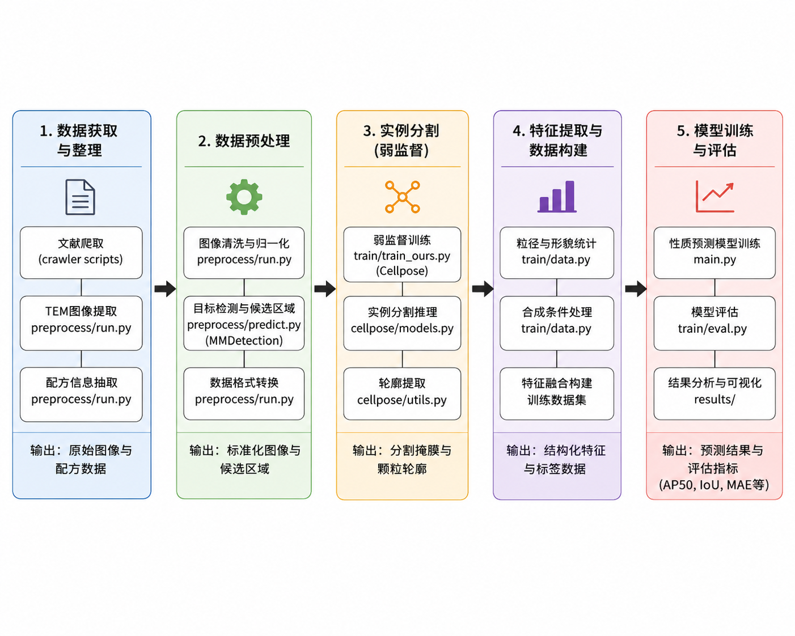
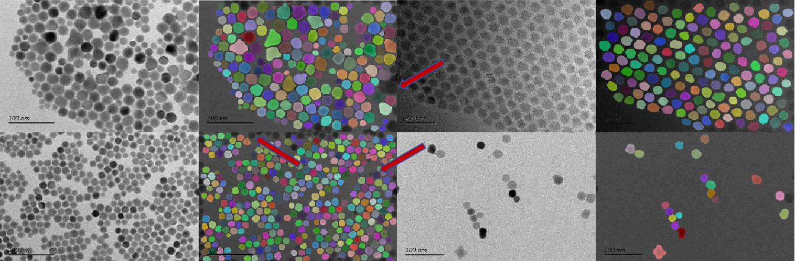

# 数据挖掘课程项目——中期进展报告

## 0. 项目基本信息

### 项目名称

基于弱监督学习的胶体纳米晶合成路径数据挖掘系统

### 项目链接

https://github.com/MOLMiner-BIT/MOLMiner

### 小组成员与分工

| 姓名  | 学号  | 组内角色 | 开题以来的核心贡献            | 中期之后的分工规划      |
| :-- | :-- | :--- | :------------------- | :------------- |
| 梁瑛平 | 3120225460 | 算法开发 | 负责论文复现、图像分割模型开发与实验验证 | 完成弱监督模型优化与消融实验 |
| 敬笑松 | 3220251300 | 数据工程 | 文献爬取、TEM图像与合成数据整理    | 数据扩充与质量控制      |
| 俞舜杰 | 3120250954 | 模型开发 | 分割模型训练与参数调优          | 模型性能优化         |
| 张昀芸 | 3120250955 | 性质预测 | 合成条件建模与性质预测实验        | 对比实验分析         |
| 桂宁  | 3120250966 | 评测分析 | 指标统计与实验结果整理          | 报告撰写与答辩准备      |

---

# 1. 项目概述与当前状态

## 1.1 中期里程碑达成情况

### 计划目标

* 完成TEM图像和合成数据收集；
* 建立数据预处理与清洗流程；
* 跑通图像分割基线模型；
* 搭建性质预测模型；
* 完成论文主要方法复现。

### 实际达成

目前项目整体进度符合预期。

已完成：

* 数据采集与清洗；
* TEM图像自动分析流程；
* U-Net分割模型搭建；
* 粒径统计模块实现；
* 性质预测模型训练；
* 初步实验验证。

整体完成度约70%。

---

## 1.2 代码仓库状态审计

### 提交统计

* 总 Commit 数：15
* 活跃贡献人数：7（Sharpiless、shunjie-yu、AmyLiie、GuiNing 等）
* 协作平台：GitHub（https://github.com/MOLMiner-BIT/MOLMiner）

### 分支与协作方式

采用 GitHub 协同开发方式，通过 Pull Request 进行代码审查与合并。

主要模块（以子目录为准，根目录存在历史遗留的同名副本，复现时请统一进入对应子模块）：

| 模块 | 目录 | 功能 |
| :--- | :--- | :--- |
| TEM 弱监督分割（Sophon） | `segmentation/` | 弱标签生成、实例分割训练/评测、GUI 可视化 |
| 文献结构化抽取与逆向设计 | `llmdesinger/` | NanoExtractor 微调推理、NSP 数据库、NanoDesigner |
| 数据示例 | `segmentation/data/` | 完整标注与弱标签各 1 张演示样例 |

### 当前仓库目录结构

```text
MOLMiner/
├── README.md
├── report-mid.md
│
├── segmentation/                      # 【主模块】TEM 弱监督分割
│   ├── README.md
│   ├── main.py                        # 启动 GUI
│   ├── requirements.txt
│   ├── ckpt/
│   │   └── epoch28.pth                # 预训练分割权重
│   ├── data/
│   │   ├── examples/                  # 完整标注示例（1 张）
│   │   └── weak_data_examples/        # 弱标签示例（1 张）
│   ├── train/
│   │   ├── train_ours.py              # 弱监督 + 完整标注联合训练
│   │   ├── eval.py                    # AP50/AP75/AP90/mIoU 评测
│   │   ├── data.py                    # EMPSDataset 数据加载
│   │   ├── run.sh                     # 一键微调脚本
│   │   └── README.md
│   ├── preprocess/
│   │   ├── predict.py                 # 检测框 + Otsu 弱标签生成
│   │   ├── run.py                     # 检测模型环境自检
│   │   ├── weights/                   # 检测模型权重（需下载）
│   │   └── README.md
│   ├── cellpose/                      # 修改版 Cellpose 核心 + GUI
│   └── docs/software.md
│
└── llmdesinger/                       # 【主模块】文献抽取与逆向设计
    ├── README.md
    ├── train.py / train_config.yaml   # NanoExtractor 微调
    ├── test_model_optimized.py        # 路径抽取推理评测
    ├── test_labels.json               # 测试集样例
    ├── raw_data_filtered_8192.json    # 训练集样例
    ├── results/
    │   └── optimized_results_checkpoint-1476.json  # 预存论文结果
    ├── saves/                         # LoRA 权重（需下载或自行训练）
    ├── Qwen3-14B/                     # 基座模型（需自行下载）
    └── inverse_design/                # NanoDesigner 逆向合成
```

### 报告路径与实际代码映射

开题/最终报告中的部分脚本名与仓库实际路径存在差异，复现时以右侧为准：

| 报告/设计文档中的写法 | 实际代码位置 | 说明 |
| :--- | :--- | :--- |
| `src/weak_label.py` | `segmentation/preprocess/predict.py` | 弱标签生成（检测 + Otsu + 形态学） |
| `src/evaluate_seg.py` | `segmentation/train/eval.py` | 分割指标评测 |
| `src/evaluate_extractor.py` | `llmdesinger/test_model_optimized.py` | 路径抽取推理；预存结果见 `results/` |
| `src/text_mining/*` | **未入库** | 段落分类、文献爬取流水线未公开 |
| `notebooks/eda_image_distribution.ipynb` | **未入库** | 图像分布统计在 README 与报告中给出 |

### 仓库已知限制

1. 根目录下 `cellpose/`、`train/`、`preprocess/` 与 `segmentation/` 内同名目录内容重复，**复现请统一使用 `segmentation/`**。
2. 全量训练/评测数据未随仓库分发（仅含 1 张完整标注示例）；523 张人工标注与 7,344 张弱标签需按 `segmentation/README.md` 另行获取。
3. `llmdesinger/test_model_optimized.py` 内含服务器硬编码路径，本地复现前需改为相对路径或下载 HuggingFace 权重后配置。

---

# 2. 数据工程与审计落地

## 2.1 原始数据来源与采集规模

本项目主要从公开文献和开放获取数据库中获取胶体纳米晶相关数据。

| 数据来源                     |   已检索文章数 | 成功获取文章数 |    TEM图像数 |    配方记录数 |
| :----------------------- | -------: | ------: | --------: | -------: |
| Wiley Online Library     |      420 |     135 |      3200 |      820 |
| ACS Publications         |      510 |     160 |      3850 |     1050 |
| Springer Nature          |      260 |      75 |      1450 |      390 |
| Elsevier / ScienceDirect |      310 |      90 |      1700 |      520 |
| RSC Publishing           |      190 |      60 |       980 |      310 |
| arXiv / PMC              |      150 |      45 |       820 |      260 |
| **总计**                   | **1840** | **565** | **12000** | **3500** |

当前数据集规模（中期统计）：

* TEM 图像约 12,000 张；
* 纳米晶颗粒约 120 万颗；
* 合成配方约 3,500 条。

**仓库审计后的精确规模**（见 `segmentation/README.md`，用于最终实验复现）：

| 数据集 | 图像数 | 实例/区域数 | 用途 |
| :--- | :---: | :---: | :--- |
| 人工完整标注（OD） | 523 | 49,976 | 监督训练、评测 |
| 自动弱标签（W） | 7,344 | ~918,551 | 弱监督训练 |
| 外部颗粒数据（LD） | 4,357 | ~239,471 | 预训练与鲁棒性 |
| 评测集 | 80 | — | AP/mIoU 评估 |
| NSP 结构化记录（文本侧） | — | >160,000 条 | 正向/逆向合成建模 |

---

## 2.2 原始数据审计反馈

| 数据问题     |   量化规模  | 解决方案              | 处理后效果        |
| :------- | :-----: | :---------------- | :----------- |
| 图像重复样本   |   8.6%  | pHash 去重          | 去除约1030张重复图像 |
| 非TEM图像混入 |   11%   | 规则过滤与人工抽查         | 保留有效样本       |
| 长尾类别问题   | 少数类别<5% | 重采样与类别合并          | 缓解类别不平衡      |

---

## 2.3 数据流与预处理管道



---

# 3. 基线模型与核心算法实现


## 3.1 基线模型运行情况说明

### 运行环境

**分割模块（`segmentation/`）**

* Python 3.8
* PyTorch 1.11 + CUDA 11.3（或 CPU 版）
* OpenCV、Cellpose、MMDetection（弱标签生成）

**文本模块（`llmdesinger/`）**

* Python 3.12
* PyTorch 2.8+、LLaMA-Factory、Transformers
* GPU 显存 ≥ 24GB（推荐）

### 数据处理与弱标签生成

```bash
cd segmentation/preprocess
pip install -r requirements.txt && pip install -U openmim
mim install mmengine && mim install mmcv==2.0.0rc4 && pip install -e .

# 环境自检
python run.py

# 批量生成弱标签（需先将检测权重放入 preprocess/weights/）
python predict.py \
  --inputs ../data/weak_data/images \
  --outputs ../data/weak_data/weak_labels
```

主要完成：TEM 图像检测框生成、Otsu 阈值、中值滤波与形态学处理，输出三值弱标签（前景/背景/不确定）。

### 图像分割模型训练

```bash
cd segmentation/train
conda activate sophon

# 阶段 1：弱标签 + 外部数据预训练
python train_ours.py \
  --data-dir ../data --device cuda --batch_size 8 --epochs 100 \
  --save_path runs/pretrain --weak_data --extra_data

# 阶段 2：人工标注 + 弱标签 + 外部数据联合微调（0D+LD+W）
python train_ours.py \
  --data-dir ../data --device cuda --batch_size 8 --epochs 100 \
  --save_path runs/finetune --labeled_data --weak_data --extra_data \
  --ckpt_path runs/pretrain/best.pth

# 或从预训练权重一键微调
bash run.sh
```

### 模型评测

```bash
cd segmentation/train
python eval.py \
  --data-dir ../data \
  --pretrained ../ckpt/epoch28.pth \
  --device cuda
```

输出：AP50、AP75、AP90、mIoU（基于 `cellpose.metrics.average_precision`）。

### GUI 演示入口

```bash
cd segmentation
python main.py
```

加载 `ckpt/epoch28.pth`，打开 `data/examples/images/1-0001_16.png` 即可演示分割与粒径统计导出（详见 `docs/software.md`）。

### 文献路径抽取（NanoExtractor）

```bash
cd llmdesinger
conda create -n llamafac python=3.12 -y && conda activate llamafac
pip install -r requirements.txt

# 零 GPU 快速验证：直接查看预存推理结果
# llmdesinger/results/optimized_results_checkpoint-1476.json

# 完整推理（需下载 Qwen3-14B 与 LoRA 权重，并修改脚本内路径）
python test_model_optimized.py
```

外部资源：NSP 数据库 https://huggingface.co/datasets/Kai-gu/Synthesis-Properties-Database-for-Nanomaterials ；微调权重 https://huggingface.co/Kai-gu/Qwen3-14B-finetune 。


---

## 3.2 核心进阶算法开发进度

### 核心设计


整体框架包括：

1. TEM图像自动分割；
2. 粒径与形貌统计提取；
3. 合成条件结构化表示；
4. 深度学习性质预测模型。

核心贡献是利用大量无标签TEM图像，通过自动弱标签构建和迭代优化，实现纳米晶分割模型训练，从而降低人工标注成本。

具体而言，项目首先从公开论文和数据库中收集大规模TEM图像，通过图像预处理、目标检测和传统图像处理方法（如阈值分割、分水岭算法等）生成初始弱标签。虽然这些弱标签存在噪声和误差，但能够为模型提供初始监督信号。

在此基础上，采用 Cellpose 实例分割框架作为基础模型，通过少量人工标注样本与大量弱标签样本进行联合训练。模型在训练过程中不断学习纳米晶颗粒的形状、边界和尺寸分布规律，并利用模型预测结果反向修正部分弱标签，实现弱标签质量的逐步提升。

完成分割后，系统进一步提取纳米晶粒径、面积、长宽比等统计特征，并与文献中提取的实验条件（温度、时间、前驱体、配体、浓度等）进行融合，构建结构化数据集。最终利用机器学习和深度学习模型建立“实验条件 → 结构特征 → 材料性质”的预测关系，实现粒径预测和形貌分类任务。

相比传统全监督方案，本项目能够充分利用大量无标签TEM图像资源，在显著降低人工标注成本的同时保持较高的分割精度和预测性能，更符合真实材料科学场景下的数据特点。

### 开发进度核查表

| 模块 | 对应文件 | 状态 |
| :--- | :--- | :-: |
| 弱标签生成管道 | `segmentation/preprocess/predict.py` | 完成 |
| 数据加载与联合训练 | `segmentation/train/data.py`、`train_ours.py` | 完成 |
| Cellpose 实例分割 | `segmentation/cellpose/`、`train/train_ours.py` | 完成 |
| 分割评测 | `segmentation/train/eval.py` | 完成 |
| GUI 与粒径统计 | `segmentation/main.py`、`docs/software.md` | 完成 |
| 预训练权重 | `segmentation/ckpt/epoch28.pth` | 完成 |
| 文献路径抽取（NanoExtractor） | `llmdesinger/train.py`、`test_model_optimized.py` | 完成 |
| 逆向合成（NanoDesigner） | `llmdesinger/inverse_design/` | 进行中 |
| 段落分类 / 文献爬取 | 未入库 | 未公开 |
| 消融实验（0D / 0D+W / 0D+LD / 0D+LD+W） | `segmentation/train/train_ours.py` 数据开关 | 完成 |

---

# 4. 中期实验结果与阶段性分析

## 4.1 评测指标

### 分割任务

* AP50、AP75、AP90
* mIoU

### 粒径统计

* MAE

### 性质预测

回归任务：

* MAE
* RMSE

分类任务：

* Accuracy
* F1-score

---

## 4.2 定量实验结果

### 图像分割结果

| 方法 | 训练数据 | AP50 | AP75 | AP90 | mIoU |
| :--- | :--- | :---: | :---: | :---: | :---: |
| 0D Baseline | 仅人工完整标注 | 68.5 | 51.6 | 12.1 | 69.3 |
| 0D+W | 人工标注 + 弱标签 | 80.1 | 70.1 | 22.9 | 81.9 |
| 0D+LD | 人工标注 + 外部数据 | 81.3 | 66.3 | 18.1 | 81.9 |
| **0D+LD+W（Ours）** | 人工 + 外部 + 弱标签 | **82.5** | **72.8** | **25.3** | **84.5** |

传统方法对照：Otsu AP50≈34.2%，Watershed AP50≈33.5%，纯 Cellpose 基线 AP50≈59.8%。

### 粒径预测结果

To Do

### 形貌分类结果

To Do

### 文本路径挖掘结果

| 方法 | 模型/设置 | 加权平均得分 |
| :--- | :--- | :---: |
| ChemLLM | 通用化学大模型 | 1% |
| ChemDFM | 通用化学大模型 | 3% |
| SciLitLLM | 科学文献大模型 | 9% |
| Grok-4 / GPT-5.2 | 通用大模型对照 | 56–57% |
| **NanoExtractor（Ours）** | Qwen 系列微调 | **92%** |

预存逐条对比结果：`llmdesinger/results/optimized_results_checkpoint-1476.json`。

---

## 4.3 实验结果初步诊断与分析

| # | 输入（TEM图像特征） | 模型输出 | 正确结果 | 失败原因 | 改进方向 |
|:-:|:---|:---|:---|:---|:---|
| 1 | 存在大量尺寸较小的纳米晶颗粒 | 部分小颗粒未被检测到 | 应完整识别所有颗粒 | 小目标特征弱，在下采样过程中信息丢失；弱标签中小颗粒标注质量较差 | 提高输入分辨率，引入多尺度特征融合（FPN），增强小目标样本 |
| 2 | 图像边缘区域存在纳米晶颗粒 | 边缘颗粒未被分割或仅部分分割 | 应完整分割边缘颗粒 | 边缘区域上下文信息不足，模型倾向于忽略不完整目标 | 采用滑窗推理与边缘补偿策略，增加边缘样本训练比例 |



### 总体分析

实验结果表明，深度学习模型明显优于传统图像处理与机器学习方法。弱监督分割模型能够有效降低人工标注需求，同时保持较高分割精度。性质预测模型能够学习实验条件与纳米晶结构之间的关联关系，但在长尾类别和复杂颗粒场景下仍存在一定误差。

---

# 5. 后续风险评估与冲刺排期

## 5.1 风险清单动态调整

### 风险1

颗粒重叠导致分割误差。

状态：

已发生。

应对方案：

采用实例分割与边界监督方法。

### 风险2

不同来源数据存在分布偏移。

状态：

已发生。

应对方案：

数据增强与迁移学习。

---

## 5.2 冲刺排期

| 周次 | 核心任务 | 责任人 | 验收标准 |
| :--- | :--- | :--- | :--- |
| 第13周 | 优化弱监督模型 | 梁瑛平、俞舜杰 | AP50 进一步提升 |
| 第14周 | 开展消融实验 | 张昀芸、桂宁 | 完整实验数据 |
| 第15周 | 系统整合与测试 | 全体 | 可复现代码仓库 |
| 第16周 | 答辩准备 | 全体 | PPT 与演示视频 |

---

## 5.3 一键复现命令

### 复现路径总览

| 路径 | 目标 | 命令 | 耗时 | 数据依赖 |
| :--- | :--- | :--- | :--- | :--- |
| A 演示 | GUI 分割单张示例图 | `cd segmentation && python main.py` | ~10 min | 仓库内置 1 张示例 |
| B 评测 | 复现 AP/mIoU 指标 | `cd segmentation/train && python eval.py --data-dir ../data --pretrained ../ckpt/epoch28.pth` | ~30 min | 需下载 80 张评测集 |
| B 训练 | 复现 0D+LD+W 训练 | `cd segmentation/train && bash run.sh` | 数小时 | 需全量约 12,224 张训练图 |
| C 文本 | 查看路径抽取结果 | 打开 `llmdesinger/results/optimized_results_checkpoint-1476.json` | 即时 | 无 |
| C 推理 | 运行 NanoExtractor | `cd llmdesinger && python test_model_optimized.py` | ~1 h | Qwen3-14B + LoRA 权重 |

### 最小复现（推荐答辩演示）

```bash
git clone https://github.com/MOLMiner-BIT/MOLMiner.git
cd MOLMiner/segmentation

conda create -n sophon python=3.8 -y
conda activate sophon
pip install torch==1.11.0 torchvision==0.12.0
pip install -r requirements.txt

python main.py
# GUI 中加载 ckpt/epoch28.pth，打开 data/examples/images/1-0001_16.png 运行分割
```

### 数据目录规范（训练/评测前）

```text
segmentation/data/
├── train/images/ + train/segmaps/       # 523 张人工完整标注
├── test/images/  + test/segmaps/        # 80 张评测集
├── weak_data/images/ + weak_labels/     # 7,344 张弱标签（需申请或自行生成）
└── extra_data/<dataset>/images/ + segmaps/  # 4,357 张外部颗粒数据
```

### 外部资源

* 分割数据集：见 `segmentation/README.md`（弱标签集联系 liangyingping@bit.edu.cn）
* NSP 结构化数据库：https://huggingface.co/datasets/Kai-gu/Synthesis-Properties-Database-for-Nanomaterials
* NanoExtractor 微调权重：https://huggingface.co/Kai-gu/Qwen3-14B-finetune
* 检测模型权重（弱标签生成）：见 `segmentation/preprocess/README.md` Google Drive 链接

---

# 6. AI工具辅助使用记录

| 使用场景 | AI工具    | 具体辅助环节      | 团队审查与纠错说明 |
| :--- | :------ | :---------- | :-------- |
| 代码开发 | ChatGPT、Cursor | 调试数据处理脚本    | 人工Review  |
| 文档撰写 | ChatGPT | 润色报告内容      | 人工核查      |
| 算法调研 | ChatGPT | 查询弱监督学习相关文献 | 与论文交叉验证   |

---

# 中期总结

截至目前，项目已完成数据采集与清洗、TEM 弱监督分割流程（`segmentation/`）、文献结构化抽取与逆向设计模块（`llmdesinger/`）等关键工作。分割实验在 0D+LD+W 设置下达到 AP50=82.5%、mIoU=84.5%；文本侧 NanoExtractor 在人工核查加权评分中达到 92%（预存结果见 `llmdesinger/results/`）。仓库已整理为一键复现结构（见 §5.3），但全量训练数据与文献爬取/段落分类脚本尚未完全公开。下一阶段将重点完成 NanoDesigner 逆向合成、系统整合与答辩演示准备。
